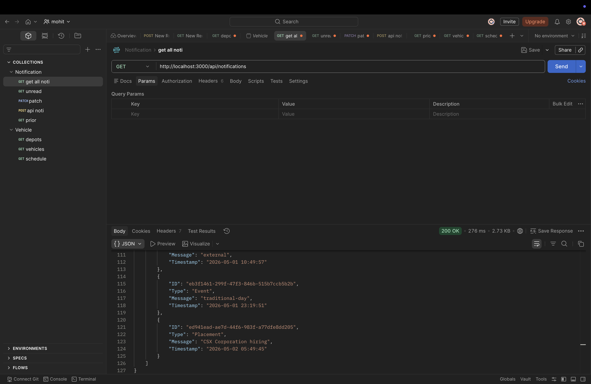
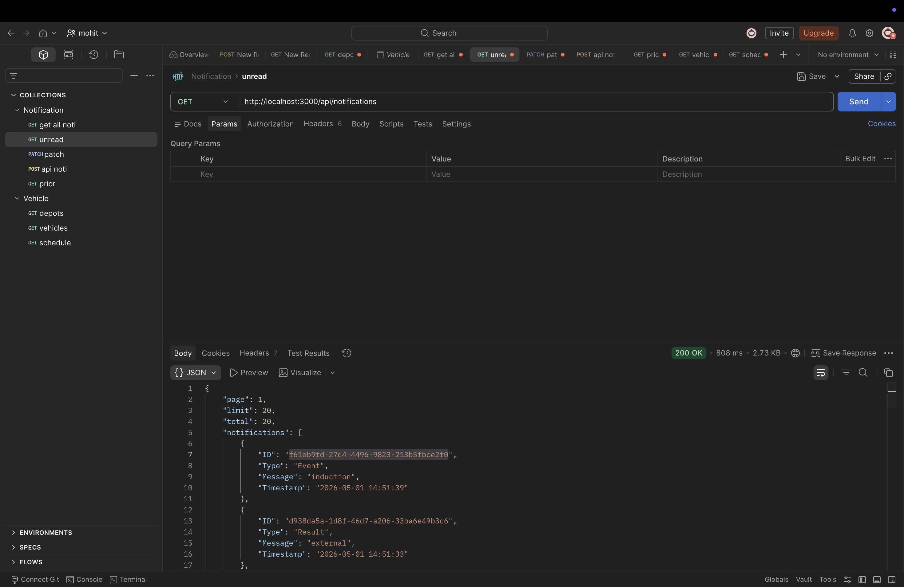
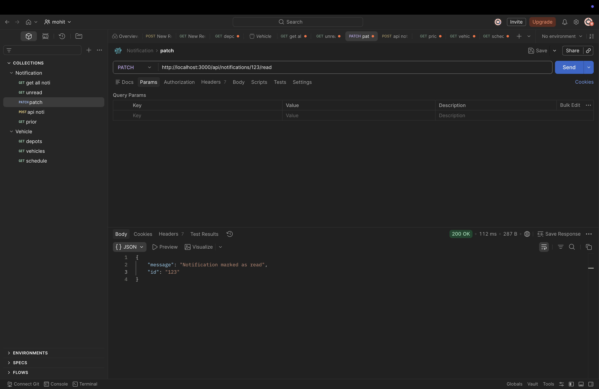
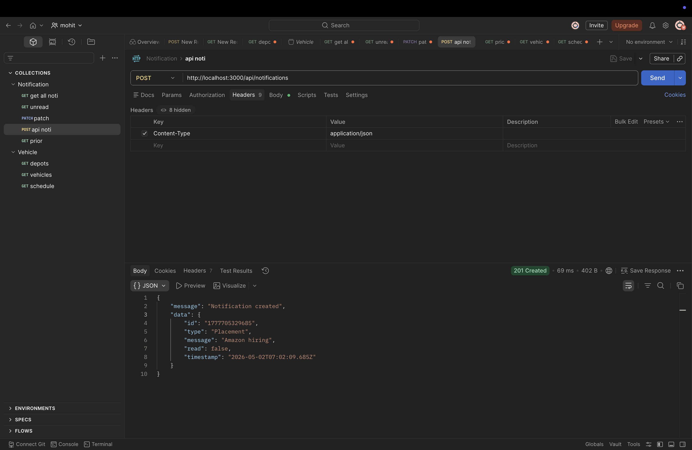
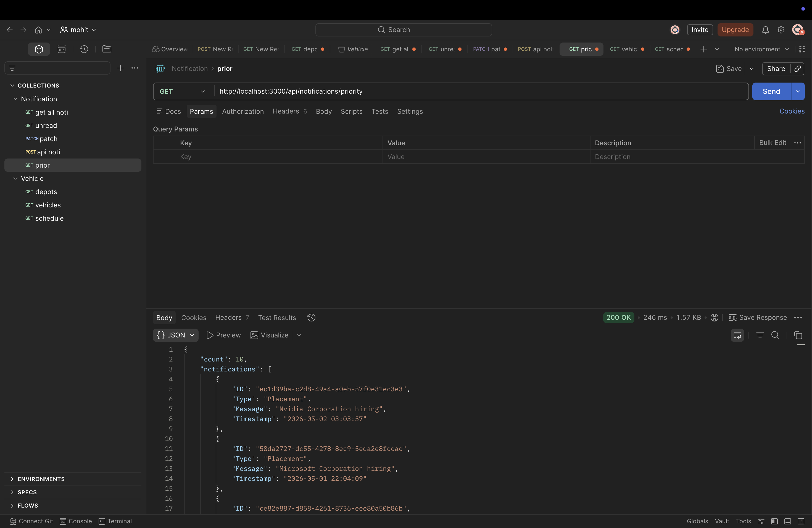

# Notification App — API Screenshots

## GET /api/notifications

## GET /api/notifications/priority?n=10

## GET /api/notifications/stats

## GET /api/notifications/:id

## GET /api/notifications?type=Placement

